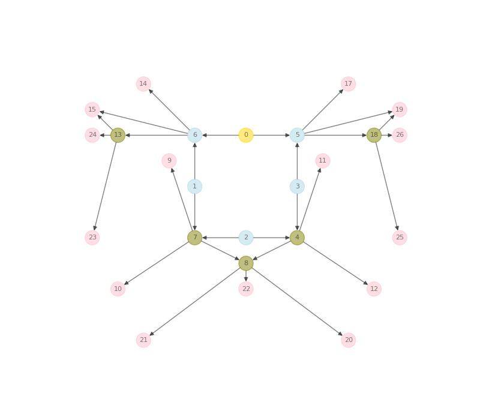
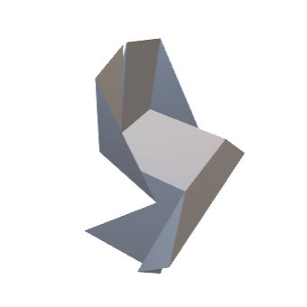
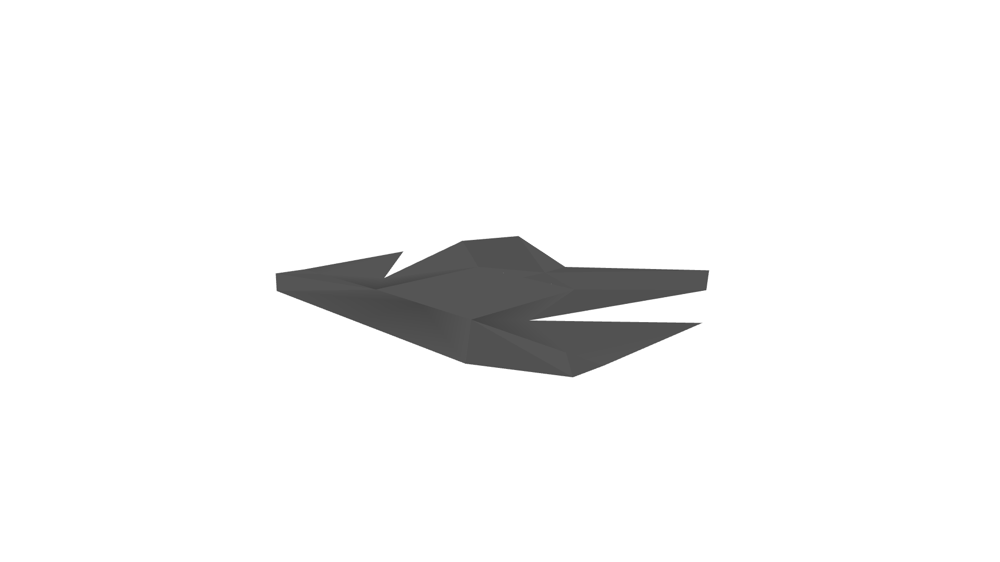

# Rigid-origami
A **gym environment and commandline tool** for automating rigid origami crease pattern design. 

> **Note** We provide an introduction to the underlying principles of rigid origami and some practical use cases in our paper [Automating Rigid Origami Design](https://arxiv.com).

We reformulate the rigid-origami problem as a board game: agents (players) interact with the rigid-origami **gym environment** (board) according to a set of rules which define an origami-specific problem. 

<figure>
    
</figure>

Figure: *The rigid origami game.*

Our commandline tool comprises a set of agents (or classical search methods and algorithms) for 3D shape approximation, packaging, foldable funiture and more. Whereas the environment is not limited to these particular origami design challenges and agents. 


## Installing
> **Note** Before installing the dependencies, it is recommended that you setup a [conda virtual environment](https://conda.io/projects/conda/en/latest/user-guide/getting-started.html).

Setup and activate the conda environment using the rigid-origami/conda_rigid_ori_env.yml package list.

```
$ conda create --name=rigid-origami --file=conda_rigid_ori_env.yml
$ conda activate rigid-origami
```

Next install the gym-environment.

```
(rigid-origami) $ cd gym-rori
(rigid-origami) $ pip install -e .
```

The environment is now all set up.

## Example
We *play* the rigid-origami game for shape approximation. 

```
(rigid-origami) $ python main.py --objective=shape-approx --search-algorithm=RDM --num-steps=100000 --board-length=25 --num-symmetries=2 --optimize-psi  
```

Adjust the game objective, agent, or any other conditions by setting specific options.

> **Note** You can utilize the environment for different design tasks or objectives. You can add your custom reward function in the [rewarder](gym-rori/rewarders.py).

A non-exhaustive list of the basic game settings is given below.

|  Option                       | Flag                | Value                                       |
| -------------                 |-------------:       | :-----                                      |
| **Name**                      | --name              | "Experiment 0"                              |
| **Game objective**            | --objective         | shape-approx, packaging, chair, table, shelf|
| **Agent**                     | --search-algorithm  | RDM, MCTS, evolution, PPO, DFTS, BFTS       |
| **Number of env interactions**| --num-steps         | 1000                                        |
| **Number of symmetry axes**   | --num-symmetries    | 1                                           |
| **Board edge length**         | --board-length      | 25                                          |
| **Seed pattern**              | --base              | simple                                      |
| **Random seed**               | --seed              | 123                                         |
| **Auto optimize fold angle**  | --optimize-psi      |                                             |

> **Note** The action- and configuration space complexity grows exponentially with the board size. On the contrary additional symmetries help reduce the complexity.

## Components

### Environment
The gym environment class [RoriEnv](gym-rori/gym_rori/envs/rori_env.py) contains the methods for the agents to interact with.

In essence agents construct graphs of connected [single vertices](gym-rori/single_vertex.py) in the environment, from which they receive sparse rewards in return.

Rewards depend on the set objective and [rewarder](gym-rori/rewarders.py). 

> **Note** You can add deploy your custom rewarder [here](gym-rori/rewarders.py).

A game terminates if a terminal state is reached, either by choice of the terminal action of the agent or by violation of a posteriori foldability [conditions](#rules).

### Agents
Agents interact with the environment. They can be human or artificial. We provide a list of standard search algorithms as artificial agents.

|       Agent               |   Search Algorithm                |
|   :-----------            |   ---------------:                |
| [RDM](main.py)            | Uniform Random Search             |
| [BFTS](gym-rori/bfts.py)  | Breadth First Tree Search         |
| [DFTS](gym-rori/dfts.py)  | Depth First Tree Search           |
| [MCTS](gym-rori/mcts.py)  | Monte Carlo Tree Search           |
| [evolution](main.py)      | Evolutionary Search               |
| [PPO](main.py)            | Proximal Policy Optimization (RL) |

> **Note** You can add you own custom agent or search-algorithm in the [main](main.py).

### Rules
<a href="#rules"></a>
[Rules](gym-rori/rules.py) and [symmetry-rules](gym-rori/symmetry_rules.py) are enforced a priori through action masking, constraining the action space of agents.

A game can however reach a non-foldable state. A particular state is foldable if and only if it complies with the following conditions:

1. Faces do not intersect during folding as proven by a [triangle-triangle intersection test](gym-rori/tritri_intsec_check.py).
2. The corresponding Origami Pattern is rigidly foldable as validated by the [kinematic model](gym-rori/kinematic_model_num.py).

Any violation of the two conditions results in a terminal game state.

### Results
The episodes (origami patterns) of highest return are documented in the results directory per experiment. For each best episode three files, a *.png* of the corresponding origami graph, folded shape *.obj* and animation *.gif* are stored.

|       Origami Graph (Pattern)                     |   Folded Shape                                    |   Folding Animation
|   :-----------:                                   |   :---------------:                               |   :---------------: 
|  |   | 


